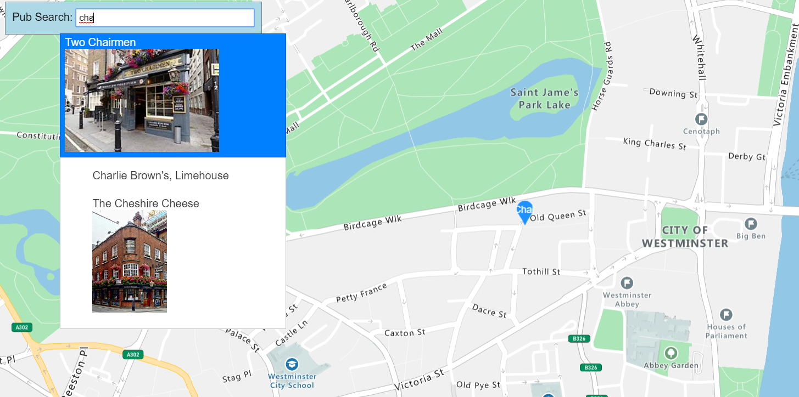

# Pubs Of London
My testing area for 
- [Azure Search](https://azure.microsoft.com/en-gb/services/search/)
- [Azure Maps](https://azure.microsoft.com/en-us/services/azure-maps/) 
- [Azure Static Websites](https://docs.microsoft.com/en-us/azure/storage/blobs/storage-blob-static-website)

## The Plan
- Take this [page from wikipedia](https://en.wikipedia.org/wiki/List_of_pubs_in_London)
- Turn it into a website 

## Current Features
- [Fuzzy search](https://en.wikipedia.org/wiki/Approximate_string_matching) on pub names
- Click or enter on pub to locate on map

### Scrape
- WebScraper:  https://www.webscraper.io/cloud-scraper
- [Configuration for the scraper](Scraper/ScraperConfig.json)

Once complete, export the data to [PubsOfLondon.csv](IndexUpdater/pubsoflondon.csv)

### Push to the Index
1. Create an API key on the Azure Portal: `Home -> Search services -> londonpubs - Keys`
1. Run the [Index Updater](IndexUpdater/IndexUpdater)

### Website
1. Create a static Azure website 
2. Upload the contents of the [Website folder](Website)

## Rough idea
- Map locations
- Best choice of multiple locations
- Trip Advisor? 

## Enhancements
- Show pubs using a WebGL layer (too many to display via HTML)
- Loads of mapping features are needed
- Angular / React front end
- Domain name
